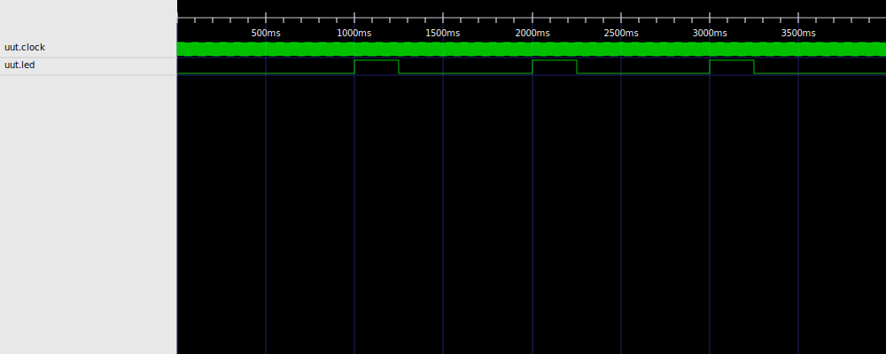
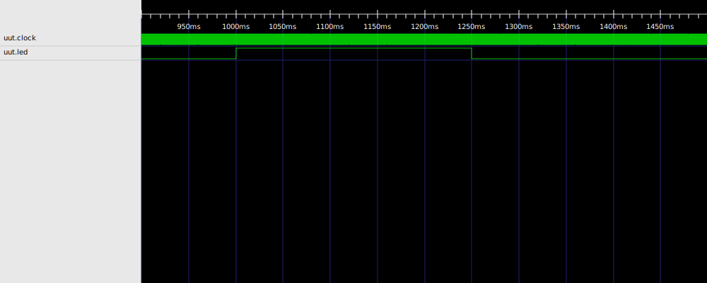

+++
title = "RustHDL"
sort_by = "weight"
+++

# RustHDL

**RustHDL** is a new way to write firmware for FPGAs using the Rust Programming Language as a Hardware Description Language.

* Safe - have Rust check the validity of your firmware with strongly typed interfaces that are checked at *compile* time,
as well as static analyzers, and simulation and synthesis tools to validate your design before you get to the bench.
* Fast - Run simulations of your designs straight from your
Rust code, with pretty good simulation performance.
* Readable - RustHDL outputs Verilog code for synthesis and
implementation, and goes through some effort to make sure that
code is readable and understandable, in case you need to resolve
timing issues or other conflicts.
* Reusable - RustHDL supports templated firmware for parametric
use, as well as a simple composition model based on structs.
* Batteries Included - RustHDL includes a set of basic firmware
widgets that provide FIFOs, RAMs and ROMs, Flip flops, SPI components,
PWMs etc, so you can get started quickly 🔋.
* Free - Although you can use RustHDL to wrap existing IP cores,
all of the RustHDL code and firmware is open source and free to use (as in speech and beer 🍺).
* Tested - RustHDL has been used to write firmware that is shipping in commercial products.
This includes quite complicated designs that use nearly all of a moderately sized FPGA,
and take advantage of specialized hardware in the FPGAs themselves 🦑.

# Quickstart

If you have never coded in Rust before, I suggest you head over to the [Rust Book](https://doc.rust-lang.org/book/), and
work through that first.  You don't need to be a Rust Wizard 🪄 to write firmware using RustHDL.  But I assume you know
the basics.

To add `rust-hdl` to your project, simply create a new project and then add `rust-hdl` as a dependency:
```shell
samitbasu@fedora jnk]$ cargo new testme
     Created binary (application) `testme` package
[samitbasu@fedora jnk]$ cd testme
[samitbasu@fedora testme]$ cargo add rust-hdl
    Updating crates.io index
      Adding rust-hdl v0.38.2 to dependencies.
[samitbasu@fedora testme]$ 
```

To get the most benefit from `rust-hdl` you should probably 
install [yosys](https://github.com/YosysHQ/yosys).
`Yosys` provides more sophisticated checking on the generated Verilog and it also provides some
synthesis pathways for some of the more open-source friendly FPGAs.

Then replace `main.rs` with the following.

```rs
use std::time::Duration;
use rust_hdl::prelude::*;

const CLOCK_SPEED_HZ : u64 = 10_000;

#[derive(LogicBlock)]  // <- This turns the struct into something you can simulate/synthesize
struct Blinky {
    pub clock: Signal<In, Clock>, // <- input signal, type is clock
    pulser: Pulser,               // <- sub-circuit, a widget that generates pulses
    pub led: Signal<Out, Bit>,    // <- output signal, type is single bit
}

impl Default for Blinky {
   fn default() -> Self {
       Self {
         clock: Default::default(),
         pulser: Pulser::new(CLOCK_SPEED_HZ, 1.0, Duration::from_millis(250)),
         led: Default::default(),
       }
    }
}

impl Logic for Blinky {
    #[hdl_gen] // <- this turns the update function into an HDL Kernel that can be turned into Verilog
    fn update(&mut self) {
       // v-- write to the .next member     v-- read from .val() method
       self.pulser.clock.next = self.clock.val();
       self.pulser.enable.next = true.into();
       self.led.next = self.pulser.pulse.val();
    }
}

fn main() {
    // v--- build a simple simulation (1 testbench, single clock)
    let mut sim = simple_sim!(Blinky, clock, CLOCK_SPEED_HZ, ep, {
        let mut x = ep.init()?;
        wait_clock_cycles!(ep, clock, x, 4*CLOCK_SPEED_HZ);
        ep.done(x)
    });

    // v--- construct the circuit
    let uut = Blinky::default();
    // v--- run the simulation, with the output traced to a .vcd file
    sim.run_to_file(Box::new(uut), 5 * sim_time::ONE_SEC, "blinky.vcd").unwrap();
    vcd_to_svg("blinky.vcd","blinky_all.svg",&["uut.clock", "uut.led"], 0, 4 * sim_time::ONE_SEC).unwrap();
    vcd_to_svg("blinky.vcd","blinky_pulse.svg",&["uut.clock", "uut.led"], 900 * sim_time::ONE_MILLISECOND, 1500 * sim_time::ONE_MILLISECOND).unwrap();
}
```

Finally, run this simulation
```shell
[samitbasu@fedora testme]$ cargo run --release
   Compiling testme v0.1.0 (/home/samitbasu/Devel/jnk/testme)
    Finished release [optimized] target(s) in 0.92s
     Running `target/release/testme`
[samitbasu@fedora testme]$ 
```

You should now have a `vcd` file that can be viewed with a tool like [gtkwave](http://gtkwave.sourceforge.net/).  Alternately, RustHDL 
includes the ability to generate an `svg` file from the `vcd` file.
This is the end result showing the entire simulation:

Here is a zoom in showing the pulse to the LED



# Next Steps

- If you don't know what an FPGA is, head over to the [guide](@/guide/index.md).
- The [documentation](https://docs.rs/rust-hdl/latest/rust_hdl) for RustHDL is hosted on `doc.rs`.
- The crate is hosted on [crates.io](https://crates.io/crates/rust-hdl).

# Change Log

You can go to the [changelog](@/changelog.md) page to see what changes are happening.

# References

RustHDL was inspired by and borrows from the following awesome projects!  They are listed in
no particular order...

- LucidHDL is a very cool HDL developed by the folks over at [alchitry](https://www.alchitry.com).  I initially
started writing tooling to manipulate Lucid using Rust, and then realized that it would be better for
me to just use Rust itself.  But there is some great stuff on their website, and their book is excellent.
- AlchitryLabs is a n IDE from [alchitry](https://www.alchitry.com) that supports the LucidHDL.  They open sourced 
it and it is an impressive piece of software.
- For Python fans, [MyHDL](myhdl.org) is a Python based approach to generating HDL.  If you consider yourself a Python person, check it out.  After I left Verilog, I first rewrote a fair chunk of firmware using MyHDL and Python.  In the end, it wasn't for me, but many of the ideas are very cleanly expressed.
- _The_ open source toolchain that started it all is [IceStorm](https://clifford.at/icestorm) Open Source tool chain for the `iCE 40` FPGA, and an incredibly powerful concept.  In particular, Claire's work demonstrated a software-like path for handling FPGAs that was critical to a number of open source FPGA-centric projects. 
- [YoSys](https://github.com/YosysHQ/yosys) is the Verilog synthesis suite used by [RustHDL] to 
process generated Verilog and check a design for potential errors (static analysis).  
- [Icarus](http://iverilog.icarus.com/) is a verilog simulator that is software based, open source
and easy to use.  Before [RustHDL] got it's own simulator, I would write and simulate everything
using [Icarus].
- [Verilator](https://www.veripool.org/verilator/) I'd condsider this the professional option
for simulation (particularly of super complicated designs).  [RustHDL] doesn't come anywhere near
the simulation performance of [Verilator] yet, but the goal is to either generate Verilog that
[Verilator] can process, or adopt the same types of techniques described by the author in this 
[paper](https://veripool.org/papers/Verilator_Internals1_202010.pdf).

